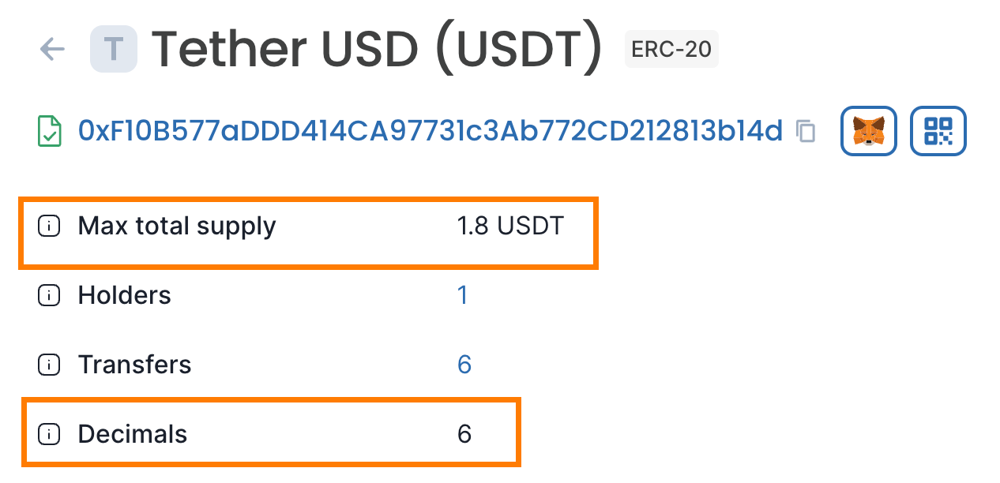

# Tokens

## Adding tokens to MetaMask

### Extension

1. Click on 'Import tokens', located at the bottom of the 'Tokens' tab on your wallet homepage.
2. Switch to the 'Custom token' tab at the top, and then enter the token address in the first field. 
3. In most cases, the token symbol and token decimal will autofill. If they don't, head to the [Nal block explorer](https://scan.nal.network/) and find the token to get the symbol and decimals.

<!--  -->

1. Click 'Add Custom Token' to proceed.
2. You will now see a page asking you to confirm that you want to add the token. When you click 'Import Tokens', the token type will be added to your wallet.

<!--  -->

### Mobile

1. Find the 'Import tokens' link from your wallet homepage. Tap it to bring up the menu for adding tokens.
2. Switch over to the 'Custom token' tab. Now you'll see three fields asking for the token's contract address, its symbol, and 'Token of Precision' (i.e. how many decimal places it can go down to).
3. Find the token address and paste it into the first field. The symbol and decimals should autofill. If they don't, head to the [Nal block explorer](https://scan.nal.network/) and search for the token. On its page, you can easily find its symbol and decimals.

<!--  -->

1. Tap 'Import' to add it to your wallet. You'll be redirected back to your wallet homepage and be able to see it under the 'tokens' tab.

<!--  -->

------

## Bridged token addresses

Various ERC-20 tokens originally deployed to Ethereum also have corresponding "bridged" representations on Nal mainnet. This page exists to help users discover the correct bridged token addresses for each token.

💡 **Tokens listed on this page are provided for convenience only. The presence of a token on this page does not imply any endorsement of the token or its minter.**

### Nal Mainnet

| Name | Symbol | L1 Token | L2 Token |
| --- | --- | --- | --- |
| Ether | ETH | [0x0000000000000000000000000000000000000000](https://etherscan.io/address/0x0000000000000000000000000000000000000000) | [0xDeadDeAddeAddEAddeadDEaDDEAdDeaDDeAD0000](https://scan.nal.network/address/0xDeadDeAddeAddEAddeadDEaDDEAdDeaDDeAD0000) |
| Tether USDT | USDT | [0xdAC17F958D2ee523a2206206994597C13D831ec7](https://etherscan.io/token/0xdAC17F958D2ee523a2206206994597C13D831ec7) | [0xf10b577addd414ca97731c3ab772cd212813b14d](https://scan.nal.network/token/0xf10b577addd414ca97731c3ab772cd212813b14d) |
| USDC | USDC | [0xA0b86991c6218b36c1d19D4a2e9Eb0cE3606eB48](https://etherscan.io/token/0xA0b86991c6218b36c1d19D4a2e9Eb0cE3606eB48) | [0xc58d7f2f6b3cc51f9ed1c7a952c79104e4f81be7](https://scan.nal.network/address/0xc58d7f2f6b3cc51f9ed1c7a952c79104e4f81be7) |

### Nal testnet(Sepolia)

| Name | Symbol | L1 Token | L2 Token |
| --- | --- | --- | --- |
| Ether | ETH | [0x0000000000000000000000000000000000000000](https://sepolia.etherscan.io/address/0x0000000000000000000000000000000000000000) | [0xDeadDeAddeAddEAddeadDEaDDEAdDeaDDeAD0000](https://testnet-scan.nal.network/address/0xDeadDeAddeAddEAddeadDEaDDEAdDeaDDeAD0000) |
| NAL-TEST USDT | USDT | [0x84E7a252AD39Cc9BFcDcB16208c3e912a313be97](https://sepolia.etherscan.io/token/0x84E7a252AD39Cc9BFcDcB16208c3e912a313be97) | [0xe4f926348d533d2b20857bd4d96ba92a4ceb9c15](https://testnet-scan.nal.network/token/0xe4f926348d533d2b20857bd4d96ba92a4ceb9c15) |
| NAL-TEST USDC | USDC | [0x3b423b8f6d28601bef9352f4c1cc9c1fa72e6450](https://sepolia.etherscan.io/token/0x3b423b8f6d28601bef9352f4c1cc9c1fa72e6450) | [0xe3b1a545130163ff977e06bcbae9bc55ec7ddaf6](https://testnet-scan.nal.network/token/0xe3b1a545130163ff977e06bcbae9bc55ec7ddaf6) |

------

## Security

### Nal Mainnet Security Model

Nal Mainnet is a work in progress. Constant, iterative improvement of the security mechanisms that safeguard Nal Mainnet users is a top priority for the entire Nal Labs. The Nal Labs strives to be clear and transparent about the security of Nal Mainnet.

#### Bottom Line

The security model of any blockchain system is only as strong as its lowest common denominator. At the moment, **it's important to understand that the security of Nal Mainnet is dependent on a [multisig](https://etherscan.io/address/0x3Da41e13c9a01a20a91B1d9603357d0d89BEBfAe)** managed by the Nal Security Council.
