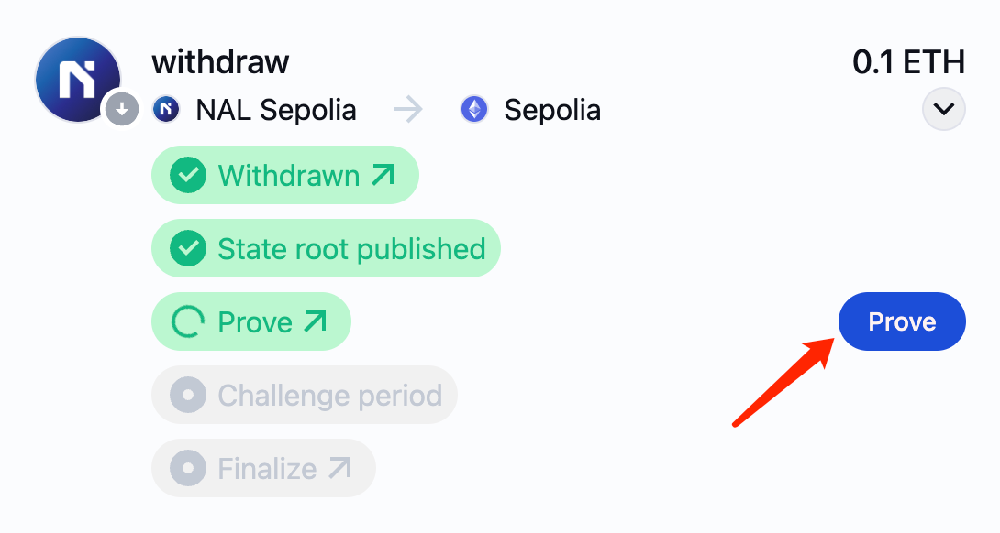
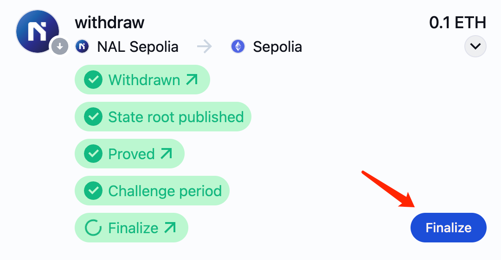

# Tools

## Explorer

### Blockscout

A Blockscout explorer is available for [Nal](https://scan.nal.network/).

Blockscout provides tools to help you debug smart contracts and transactions:

- View, verify, and interact with smart contract source code.
- View detailed transaction information

A testnet explorer for [Nal Sepolia](https://testnet-scan.nal.network/) is also available.

------

## Bridge

[Nal Bridge](https://bridge.nal.network/) enables you to bridge ETH and other supported assets from Ethereum mainnet or Sepolia testnet (L1) directly to Nal or Nal testnet (L2) .

### Instruction

#### Connect wallet

1. Open [Nal Bridge](https://bridge.nal.network/deposit)
2. Click the 'Connect' button in the top right corner to connect your wallet.

3. Choose a wallet of your preference (i.e. [MetaMask](https://chrome.google.com/webstore/detail/metamask/nkbihfbeogaeaoehlefnkodbefgpgknn)). If not installed, click 'Get' in the bottom right corner to install. If installed, select the account you want to connect, and follow the prompts in Metamask to authorize and connect to Nal Bridge.

4. Switch Account: select an account in Metamask, and Nal Bridge will automatically switch to the new account (if not authorized please follow the instruction in MetaMask).

#### Deposit from Ethereum to Nal

1. Click 'Deposit' and select the currency you want to deposit: ETH/USDT/USDC.

2. Input the amount to deposit, then click the 'Review Deposit' button(if not connected to required network, please click to ‘Switch to xx’).

3. Read and check the three statements, then click the 'Initiate Deposit' button.

4. Confirm the authorization and transaction in Metamask popup window.
5. Navigate to the Activity page and wait for the transaction to complete. You could click 'L2 Confirmation' in the status bar to view the transaction information on Nal explorer.

#### Withdraw from Nal to Ethereum

1. Click 'Withdrawal' and select the currency to withdraw: ETH/USDT/USDC.

2. Input the amount to withdrawl, then click the 'Withdrawl Deposit' button(if not connected to required network, please click to ‘Switch to xx’).

3. Read and check the three statements, then click the 'Submit Withdrawal' button.

    
4. Confirm the authorization and transaction in Metamask popup window.
5. Navigate to the Activity page. ‘State root published’ may take an hour, when it’s done you could click 'Prove' button and finish prove confirmation in Metamask popup window.

6. The next ‘Challenge period’ usually take seven days, after that, click the 'Finalize' button and confirm in Metamask.

7. After completing the finalize transaction, you could click 'Finalize' to view the transaction information on Etherscan. And your assets should be bridged from Nal to Ethereum by now.

------

## Faucet

To obtain test tokens on Nal Sepolia (testnet), first claim Sepolia ETH from the faucet, and then use the [bridge](https://bridge.nal.network/) to transfer it to Nal. Here’s some faucet listed for your reference.

### Alchemy Faucet

The [Alchemy Faucet](https://www.alchemy.com/faucets/ethereum-sepolia) is a fast and reliable network faucet that allows users with a free Alchemy account to request testnet ETH on Ethereum Sepolia.

### Bware Labs Faucet

[Bware Labs Faucet](https://bwarelabs.com/faucets/ethereum-sepolia) is an easy to use faucet with no registration required. You can use Bware Labs Faucet to claim Ethereum Sepolia testnet ETH for free - one claim per 24 hours.

### QuickNode Faucet

[QuickNode Faucet](https://faucet.quicknode.com/drip) is an easy to use Multi-Chain Faucet. You can use QuickNode Faucet to claim Ethereum Sepolia testnet ETH for free - one drip per network every 12 hours.

### LearnWeb3 Faucet

[LearnWeb3 Faucet](https://learnweb3.io/faucets/sepolia/) is a multi-chain faucet by LearnWeb3. You can use the LearnWeb3 faucet to claim Ethereum Sepolia testnet ETH for free - one claim every 24 hours.

### Ethereum Ecosystem Faucet

The [Ethereum Sepolia Faucet](https://www.ethereum-ecosystem.com/faucets/ethereum-sepolia) is a free & easy to use testnet faucet for Ethereum Sepolia with very generous drips that doesn't require users to log in.